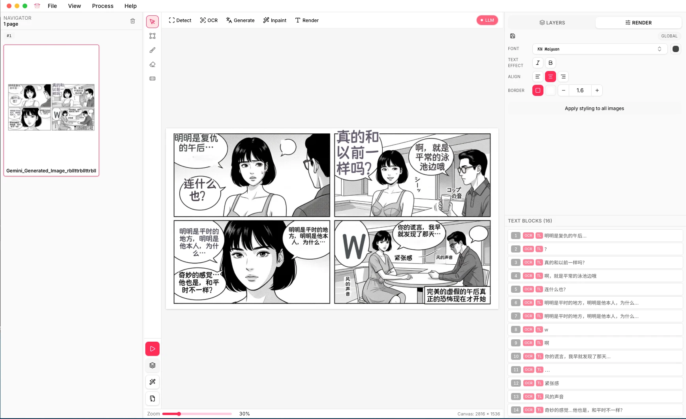

# Manga Offline Translate

[日本語](./docs/README.ja.md) | [简体中文](./docs/README.zh-CN.md)

ML-powered offline manga translator, written in **Rust**.

Manga Offline Translate is an unofficial fork of
[Koharu](https://github.com/mayocream/koharu), maintained by MLT. It is not
affiliated with, sponsored by, or endorsed by the original Koharu maintainers.

Original project: https://github.com/mayocream/koharu

Fork source: https://github.com/mattlifetech/manga-offline-translate

License: GNU General Public License v3.0 only. See [LICENSE](LICENSE) and
[NOTICE.md](NOTICE.md).

This fork is based on Koharu 0.37.0 source history. The closest upstream
merge-base in this fork is `23f7d9fb9b4e9fcbab16ce317660cb91576ce15f` from
`mayocream/koharu`.

Manga Offline Translate introduces a new workflow for manga translation, utilizing the power of ML to automate the process. It combines the capabilities of object detection, OCR, inpainting, and LLMs to create a seamless translation experience.

Under the hood, Manga Offline Translate uses [candle](https://github.com/huggingface/candle) for high-performance inference, and uses [Tauri](https://github.com/tauri-apps/tauri) for the GUI. All components are written in Rust, ensuring safety and speed.

> [!NOTE]
> Manga Offline Translate runs ML models **locally** on your machine. No image
> data is sent to external servers by the app.

---



> [!NOTE]
> For help and support, please join our [Discord server](https://discord.gg/mHvHkxGnUY).

## Features

- Automatic speech bubble detection and segmentation
- OCR for manga text recognition
- Inpainting to remove original text from images
- LLM-powered translation
- Vertical text layout for CJK languages
- MCP server for AI agents

## Usage

### Output folders

When images are opened from a local folder, Manga Offline Translate writes intermediate and final
outputs next to the source images:

- `inpainted/`: pages after original text removal
- `rendered/`: translated pages after text rendering

Keeping these files beside the source images makes batch results easy to inspect,
clear, or archive without searching the application cache folder.

During batch processing, Manga Offline Translate may skip an oversized or problematic inpainting
region if running the ML inpaint model for that region would exceed the GPU
allocation limits. The page continues processing where possible, and the batch
continues with later images instead of stopping on that file.

### Toolbars

- **Left Toolbar**:
  - **Dustbin Icon**: Clear the current file list.
- **Middle Vertical Toolbar**:
  - **Run this image**: Process the currently selected image.
  - **Run all (all images)**: Process all images in the list sequentially.
  - **Apply style to all slides**: Render all slides using the saved font, text effects, and alignment settings.
  - **Run all to CBZ**: Process all images and package the results into a single compressed CBZ file.
- **Right Toolbar**:
  - **Auto Load**: Saves and auto loads your preferred font, text effects, alignment, LLM model, and language settings.

### Hot keys

- <kbd>Ctrl</kbd> + Mouse Wheel: Zoom in/out
- <kbd>Ctrl</kbd> + Drag: Pan the canvas
- <kbd>Del</kbd>: Delete selected text block

### MCP Server

Manga Offline Translate has a built-in MCP server that can be used to integrate with AI agents. By default, the MCP server will listen on a random port, but you can specify the port using the `--port` flag.

```bash
# macOS / Linux
manga-offline-translate --port 9999
# Windows
manga-offline-translate.exe --port 9999
```

You can input `http://localhost:9999/mcp` into the MCP server URL field in your AI agent.

### OpenClaw AI Agent Skill

Manga Offline Translate provides a built-in [OpenClaw Skill](https://openclaw.ai/) to automate batch translation of manga archives (ZIP/CBZ). When triggered, an AI agent can automatically scan a folder, launch Manga Offline Translate via MCP, apply your saved settings, process all pages, and package the translated results into new CBZ files.

To use it, copy or symlink the skill directory to your OpenClaw skills folder:

- **Skill location:** [`docs/skills/manga-offline-translate-batch/`](./docs/skills/manga-offline-translate-batch/)
- **Instructions:** See the [SKILL.md](./docs/skills/manga-offline-translate-batch/SKILL.md) file for setup details and required environment variables (`MANGA_OFFLINE_TRANSLATE_INBOX` and `MANGA_OFFLINE_TRANSLATE_OUTBOX`).

### Headless Mode

Manga Offline Translate can be run in headless mode via command line.

```bash
# macOS / Linux
manga-offline-translate --port 4000 --headless
# Windows
manga-offline-translate.exe --port 4000 --headless
```

You can now access Manga Offline Translate Web UI at `http://localhost:4000`.

### File association

On Windows, Manga Offline Translate automatically associates `.khr` files, so you can open them by double-clicking. The `.khr` files can also be opened
from as picture to view the thumbnails of the contained images.

## GPU acceleration

CUDA and Metal are supported for GPU acceleration, significantly improving performance on supported hardware.

### CUDA

Manga Offline Translate is built with CUDA support, allowing it to leverage the power of NVIDIA GPUs for faster processing.

Manga Offline Translate bundles CUDA toolkit 13.1 and cuDNN 9.19, dylibs will be automatically extracted to the application data directory on first run.

> [!NOTE]
> Please ensure that your system has the latest NVIDIA drivers installed. You can download the latest drivers via [NVIDIA App](https://www.nvidia.com/en-us/software/nvidia-app/).

#### Supported NVIDIA GPUs

Manga Offline Translate supports NVIDIA GPUs with compute capability 7.5 or higher.

Please make sure your GPU is supported by checking the [CUDA GPU Compute Capability](https://developer.nvidia.com/cuda-gpus) and the [cuDNN Support Matrix](https://docs.nvidia.com/deeplearning/cudnn/backend/latest/reference/support-matrix.html).

### Metal

Manga Offline Translate supports Metal for GPU acceleration on macOS with Apple Silicon (M1, M2, etc.). This allows Manga Offline Translate to run efficiently on a wide range of Apple devices.

### CPU fallback

You can always force Manga Offline Translate to use CPU for inference:

```bash
# macOS / Linux
manga-offline-translate --cpu
# Windows
manga-offline-translate.exe --cpu
```

## ML Models

Manga Offline Translate relies on a mixin of computer vision and natural language processing models to perform its tasks.

### Computer Vision Models

Manga Offline Translate uses several pre-trained models for different tasks:

- [comic-text-detector](https://github.com/dmMaze/comic-text-detector)
- [manga-ocr](https://github.com/kha-white/manga-ocr)
- [AnimeMangaInpainting](https://huggingface.co/dreMaz/AnimeMangaInpainting)
- [YuzuMarker.FontDetection](https://github.com/JeffersonQin/YuzuMarker.FontDetection)

The models will be automatically downloaded when you run Manga Offline Translate for the first time.

We convert the original models to safetensors format for better performance and compatibility with Rust. The converted models are hosted on [Hugging Face](https://huggingface.co/mayocream).

### Large Language Models

Manga Offline Translate supports various quantized LLMs in GGUF format via [candle](https://github.com/huggingface/candle), and preselect model based on system locale settings. Supported models and suggested usage:

For translating to English:

- [vntl-llama3-8b-v2](https://huggingface.co/lmg-anon/vntl-llama3-8b-v2-gguf): ~8.5 GB Q8_0 weight size and suggests >=10 GB VRAM or plenty of system RAM for CPU inference, best when accuracy matters most.
- [lfm2-350m-enjp-mt](https://huggingface.co/LiquidAI/LFM2-350M-ENJP-MT-GGUF): ultra-light (≈350M, Q8_0); runs comfortably on CPUs and low-memory GPUs, ideal for quick previews or low-spec machines at the cost of quality.

For translating to Chinese:

- [sakura-galtransl-7b-v3.7](https://huggingface.co/SakuraLLM/Sakura-GalTransl-7B-v3.7): ~6.3 GB and fits on 8 GB VRAM, good balance of quality and speed.
- [sakura-1.5b-qwen2.5-v1.0](https://huggingface.co/shing3232/Sakura-1.5B-Qwen2.5-v1.0-GGUF-IMX): lightweight (≈1.5B, Q5KS); fits on mid-range GPUs (4–6 GB VRAM) or CPU-only setups with moderate RAM, faster than 7B/8B while keeping Qwen-style tokenizer behavior.

For other languages, you may use:

- [hunyuan-7b-mt-v1.0](https://huggingface.co/Mungert/Hunyuan-MT-7B-GGUF): ~6.3GB and fits on 8 GB VRAM, decent multi-language translation quality.

LLMs will be automatically downloaded on demand when you select a model in the settings. Choose the smallest model that meets your quality needs if you are memory-bound; prefer the 7B/8B variants when you have sufficient VRAM/RAM for better translations.

## Installation

You can download this fork's latest macOS preview release from the [releases page](https://github.com/mattlifetech/manga-offline-translate/releases/latest).

This fork currently provides macOS preview builds. For other platforms, build from source; see the [Development](#development) section below.

## Development

To build Manga Offline Translate from source, follow the steps below.

### Prerequisites

- [Rust](https://www.rust-lang.org/tools/install) (1.92 or later)
- [Bun](https://bun.sh/) (1.0 or later)

### Install dependencies

```bash
bun install
```

### Build

```bash
bun run build
```

The built binaries will be located in the `target/release` directory.

## Sponsorship

If you find the original Koharu project useful, consider sponsoring its maintainers:

- [GitHub Sponsors](https://github.com/sponsors/mayocream)
- [Patreon](https://www.patreon.com/mayocream)

## Contributors

<a href="https://github.com/mayocream/koharu/graphs/contributors">
  
</a>

## License

Manga Offline Translate is licensed under the [GNU General Public License v3.0](LICENSE). Original Koharu copyright notices are retained, and this fork's source is published at https://github.com/mattlifetech/manga-offline-translate.
